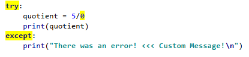
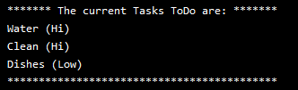

# Mod7 - Files & Exceptions
**Dev:** *Jeff Nelson*  
**Date:** *2020-06-02*  
**Code:** [Assingment07](../Assigment07.py)

## Intro  
I will go over a few interesting and important items to remember that I learned from this week’s lecture. Lastly, I will show a program that uses pickling to read and write binary files and an example of error handling. 

## Week 7 Learnings
This week I learned more about file handling, pickling, and structured error handling. When working with text files you can perform three different types of functions open(), write(), and close(). When the file open function is called you can have it in three different modes, write “w”, read “r” or append “a”. Python allows for a few different ways to read in data from a file. The first function is *readline()*, which reads one line of data and then moves to the next line. 
    
*Figure 1: Readline Example*

The next function is *readlines()*, which reads all the lines in a file, and returns a list. This is helpful when you want to read in all your data at one time into a list.    
      
*Figure 2: Readlines Example*

Using loops is a great way to capture data from a file. The for and while loops can both be used to iterate through file. For loop has a nice feature that it will automatically close the file once done.
     
*Figure 3: Readlines Example*

One other file format is binary. In Python saving to that type is called pickling. Using the pickling function allows you to store data in binary format which obscures the content of the file and can reduce the file’s size. It is important to note that the file is not encrypted but rather obscure. See Figure 4 and https://wiki.python.org/moin/UsingPickle for an example of pickling in Python.    
    
*Figure 4: Example of Pickle Function*

The last topic from this week is structured error handling. In Python, we use try-except to trap errors that the user has caused when using the program. This is good to add to your code whenever you think there might be a human cause error.  
    
*Figure 5: Example of Try-Except Error Handling*

The exception class in Python allows us as programmers the ability to add in custom error messages that make more sense to them than the developer.  You can also create your own custom exception classes.   
    
*Figure 6: Example of Try-Except Error Handling*

## Adding on to To-do List Python Program

This program's problem statement was to create a program that used pickling and structured error handling. This allowed for a different file interface and more user-friendly error messages.
First, I took my code for last week and modified it to include reading for a binary file using the *pickle.load()* function. 
```
file = open(file_name, "rb")
list_of_rows = pickle.load(file)
file.close()
```
Listing 1   

Next, the update I made was to the file writing function. Writing to a binary file I used the pickle.dump() function.   
```
objFile = open(file_name, "wb")
pickle.dump(list_of_rows, objFile)
objFile.close()
```    
Listing 2

Here is an example of what is in the binary once it is read into the programs.   
    
*Figure 7: Example of Data Read into Memory from a Binary in PyCharm*   

Here is what that binary looks like when opened in a text editor.   
    
*Figure 8: Screenshot of the Same Data Opened in a Text Editor*     

Last was to add some file error handling. I wanted to make sure the user saw a helpful message when missing the ToDoList.dat file.   
```
try:
    lstTable = Processor.read_data_from_file(strFileName)  # read file data
except FileNotFoundError as e:
     print("ToDoList.dat not found. Please create!")
     sys.exit()
except Exception as e:
     print("There was a non-specific error!")
     print(e)
     sys.exit()
```
Listing 3

Here is the error message they receive in PyCharm.    
    
*Figure 9: Screenshot of the Error Output in PyCharm*     

Here is the error message again but in the command prompt.  
    
*Figure 10: Screenshot of the same Error Message in the Command Prompt*  

## Summary
In summary, I learned more about file handling, pickling, structured error handling, and GitHub markdown language. I went through the process of how I updated my code to use binary files and better error handling. I found this assignment relatively easy but I found that creating the GitHub page pretty time-consuming. Though it was time-consuming I found it useful to know. Overall, I’m happy with the way this assignment and webpage turned out. 
